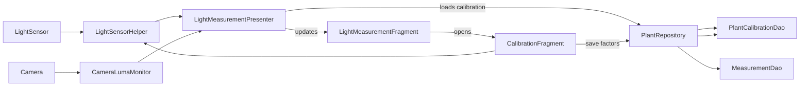
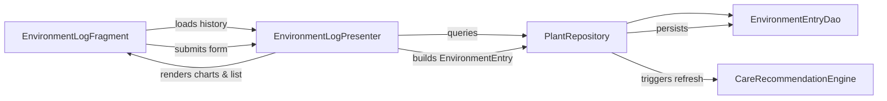
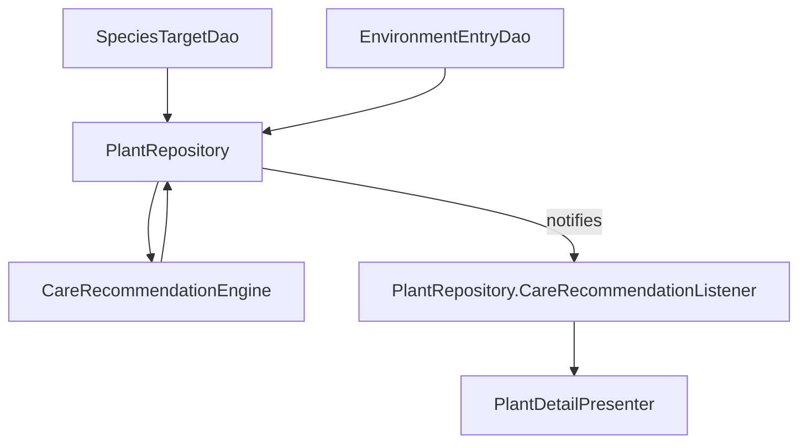
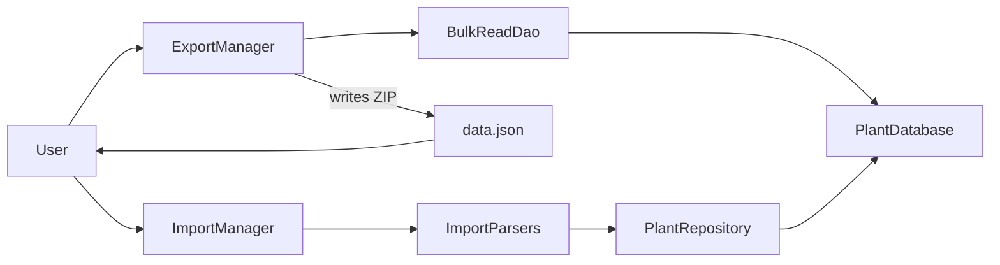
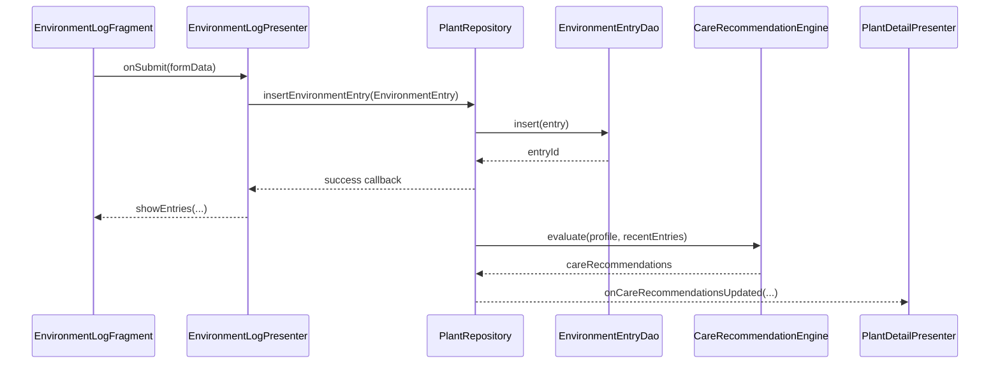

# Architecture

This document captures the current high-level structure of the app, the MVP relationships between
screens, and the data pipelines that feed Room and background work.

## Module layout

- `app` – Android application module containing Activities, Fragments, presenters, Room database,
  background workers, and instrumentation tests.

## MVP overview

Each screen is implemented as a Fragment (or the hosting `MainActivity`) paired with a presenter
that
owns the business logic. Presenters communicate exclusively with `PlantRepository`, which exposes
asynchronous APIs backed by Room DAOs. Notable pairings include:

- `MainActivity` orchestrated by `MainPresenterImpl` for navigation, import/export, and permissions.
- `PlantListFragment` using `PlantListPresenter` to load plants, handle search, and react to
  actions.
- `PlantDetailActivity` exposing plant insights through `PlantDetailPresenter`, which also listens
  for
  care recommendation refreshes.
- `LightMeasurementFragment` collaborating with `LightMeasurementPresenter` for sensor capture,
  calibration, and measurement storage.
- `DiaryFragment` and `StatsFragment` coordinating with `DiaryPresenter` and `StatsPresenter`
  respectively.
- `EnvironmentLogFragment` rendering manual environment entries via `EnvironmentLogPresenter`.

Repository callbacks are marshalled to the main thread, allowing presenters to update their attached
views synchronously without leaking executors into the UI layer.

## Data flow diagrams

### Light measurement and calibration pipeline

The presenter smooths readings from both the ambient light sensor and the camera luma monitor,
applies
per-plant calibration factors, and emits PPFD/DLI values to the fragment. The calibration fragment
lets the user persist ambient and camera factors, which are stored in the `PlantCalibration` Room
entity and fed back into future measurements.

### Environment logging pipeline

`EnvironmentLogFragment` captures manual readings for temperature, humidity, soil moisture, height,
width, and notes. `EnvironmentLogPresenter` validates the form, converts the values into an
`EnvironmentEntry`, and delegates persistence to `PlantRepository`. Reads and writes hit
`EnvironmentEntryDao`, the Room DAO backed by the `EnvironmentEntry` table. After each insert,
update, or delete the repository schedules a recommendation refresh so the rest of the app receives
new guidance.

### Care recommendation evaluation

`PlantRepository` is the only class that talks to `CareRecommendationEngine`. When environment log
entries change it reads the associated `Plant` row, resolves the linked `SpeciesTarget` through
`SpeciesTargetDao`, and hydrates a `PlantProfile` snapshot (a value object derived from the species
record). The repository also fetches the most recent `EnvironmentEntry` rows via
`EnvironmentEntryDao`. These inputs feed `CareRecommendationEngine.evaluate`, producing a list of
`CareRecommendation` objects. Dismissed recommendation IDs are filtered using the shared preferences
owned by `PlantRepository`, and final results are dispatched to
`PlantRepository.CareRecommendationListener` observers such as `PlantDetailPresenter`.

### Plant profile hydration (no dedicated table)

There is no Room table for plant profiles or recommendation snapshots. Instead, the repository maps
`SpeciesTarget` entities to immutable `PlantProfile` instances on demand, ensuring all profile data
remains in sync with the species catalog without duplicating records. Care recommendations are
computed on the fly and dismissed IDs are persisted only in shared preferences; no
`RecommendationSnapshot` or similar table exists in the database schema.

### Import / export pipeline

`ExportManager` gathers plants, LED profiles (with their calibration factors), measurements, diary
entries, reminders, species targets, and media paths via `BulkReadDao`, writes the chosen manifest
format, and zips the result with copied media files. `ImportManager` detects JSON or CSV manifests,
streams them through parser helpers, and persists the entities inside a Room transaction to ensure
atomic imports. LED profiles are restored before plants so calibration references remain valid
throughout the import.

## Background work and scheduling

Reminder notifications are routed through `ReminderScheduler`. On Android 12+ the scheduler
delegates
future triggers to `ReminderWorkManager`, which configures unique `WorkManager` jobs that invoke
`ReminderWorker` when alarms should fire. On earlier API levels the scheduler falls back to
`AlarmManager`, keeping the WorkManager code path ready once WorkManager is available on the device.
Whenever reminders are created, updated, or cancelled the scheduler broadcasts a widget update so
the
home-screen quick actions reflect the latest state.

## Calibration storage

Calibration data is primarily stored on the `LedProfile` entity inside the `calibrationFactors` map
(`LedProfile.CALIBRATION_KEY_AMBIENT` and `LedProfile.CALIBRATION_KEY_CAMERA`).
`PlantRepository` exposes `getLedCalibrationForPlant` and `saveLedCalibrationForPlant` helpers that
prefer LED profile assignments but fall back to the legacy per-plant `PlantCalibration` rows when no
profile is linked. `getLedCalibrationForPlant` returns a `LedProfileCalibration` DTO describing the
profile association and current factors, enabling callers to surface missing-profile messaging while
still honoring legacy data. These helpers are used by both `LightMeasurementPresenter` (to refresh
factors when the user selects a plant) and `CalibrationFragment` (to persist user-entered values).
Backups export the profile calibration data via the `LedProfiles` CSV section and `ledProfiles` JSON
array, restoring LED profile records before any measurements are processed so dependent calculations
use
the correct factors.

## Resource and code conventions

- Layout files follow `fragment_<feature>.xml` and `activity_<screen>.xml` naming.
- Strings, IDs, and drawables are prefixed with their feature area (e.g. `measurement_*`,
  `diary_*`).
- Java code adheres to the Android Open Source Project style guide; fragments end in `Fragment`,
  presenters end in `Presenter`, and DAO interfaces live alongside their entities.
- Use `TODO(name):` comments for follow-up work and keep indentation at 4 spaces with UTF-8
  encoding.

## Environment tab integration example

The sequence below illustrates how the Environment tab keeps Room and recommendation data in sync
when a new humidity reading is captured.

Because the presenter persists entries through the repository before any recommendation work runs,
the Room database remains the single source of truth. `PlantDetailPresenter` receives the refreshed
recommendations through its registered `CareRecommendationListener`, keeping the care card in sync
with the latest committed environment readings.
