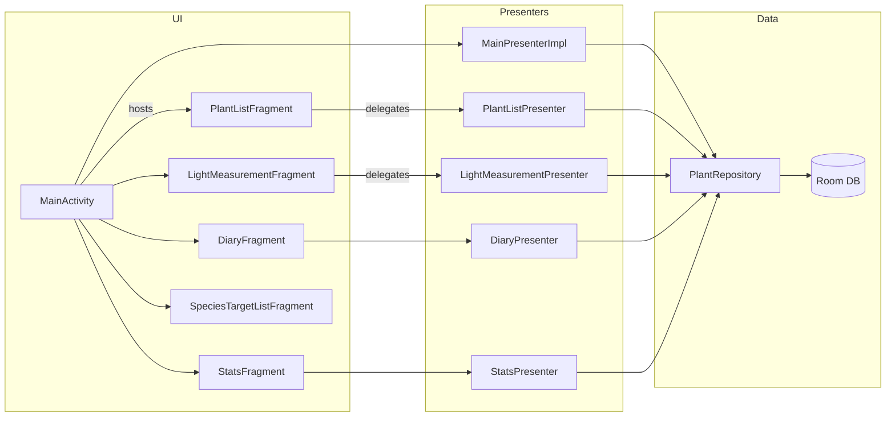
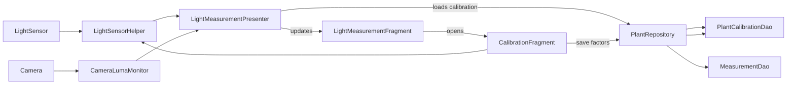
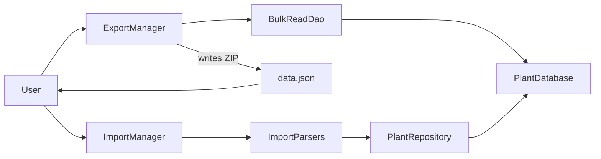

# Architecture

This document captures the current high-level structure of the app, the MVP relationships between
screens, and the data pipelines that feed Room and background work.

## Module layout
- `app` – Android application module containing Activities, Fragments, presenters, Room database,
  background workers, and instrumentation tests.

## MVP overview

Each screen is implemented as a Fragment (or the hosting `MainActivity`) paired with a presenter that
owns the business logic. Presenters communicate exclusively with `PlantRepository`, which exposes
asynchronous APIs backed by Room DAOs.

Repository callbacks are marshalled to the main thread, allowing presenters to update their attached
views synchronously without leaking executors into the UI layer.

## Data flow diagrams

### Light measurement and calibration pipeline

The presenter smooths readings from both the ambient light sensor and the camera luma monitor, applies
per-plant calibration factors, and emits PPFD/DLI values to the fragment. The calibration fragment
lets the user persist ambient and camera factors, which are stored in the `PlantCalibration` Room
entity and fed back into future measurements.

### Import / export pipeline

`ExportManager` gathers plants, measurements, diary entries, reminders, calibrations, species targets,
and media paths via `BulkReadDao`, writes the chosen manifest format, and zips the result with copied
media files. `ImportManager` detects JSON or CSV manifests, streams them through parser helpers, and
persists the entities inside a Room transaction to ensure atomic imports.

## Background work and scheduling

Reminder notifications are routed through `ReminderScheduler`. On Android 12+ the scheduler delegates
future triggers to `ReminderWorkManager`, which configures unique `WorkManager` jobs that invoke
`ReminderWorker` when alarms should fire. On earlier API levels the scheduler falls back to
`AlarmManager`, keeping the WorkManager code path ready once WorkManager is available on the device.
Whenever reminders are created, updated, or cancelled the scheduler broadcasts a widget update so the
home-screen quick actions reflect the latest state.

## Calibration storage

Per-plant calibration data lives in the `PlantCalibration` entity with columns `plantId`,
`ambientFactor`, and `cameraFactor`. `PlantRepository` exposes `getPlantCalibration` and
`savePlantCalibration` helpers used by both `LightMeasurementPresenter` (to refresh factors when a
plant is selected) and `CalibrationFragment` (to persist user-entered values). Calibrations are
exported in both CSV (`PlantCalibrations` section) and JSON (`plantCalibrations` array) backups and are
restored during imports before any measurements are processed.

## Resource and code conventions

- Layout files follow `fragment_<feature>.xml` and `activity_<screen>.xml` naming.
- Strings, IDs, and drawables are prefixed with their feature area (e.g. `measurement_*`, `diary_*`).
- Java code adheres to the Android Open Source Project style guide; fragments end in `Fragment`,
  presenters end in `Presenter`, and DAO interfaces live alongside their entities.
- Use `TODO(name):` comments for follow-up work and keep indentation at 4 spaces with UTF-8 encoding.
